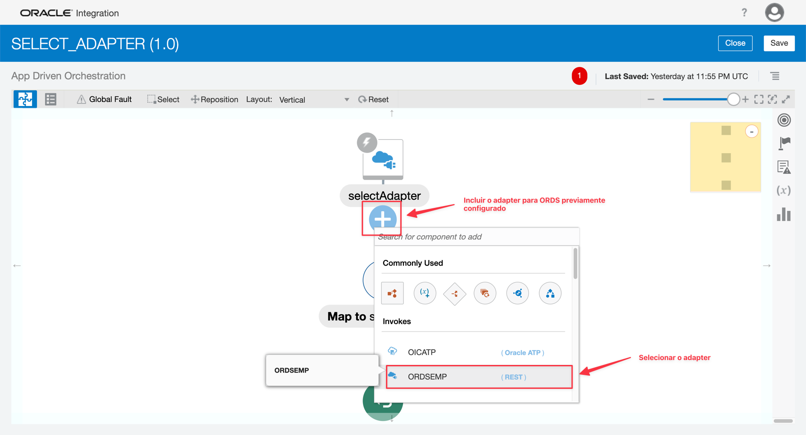
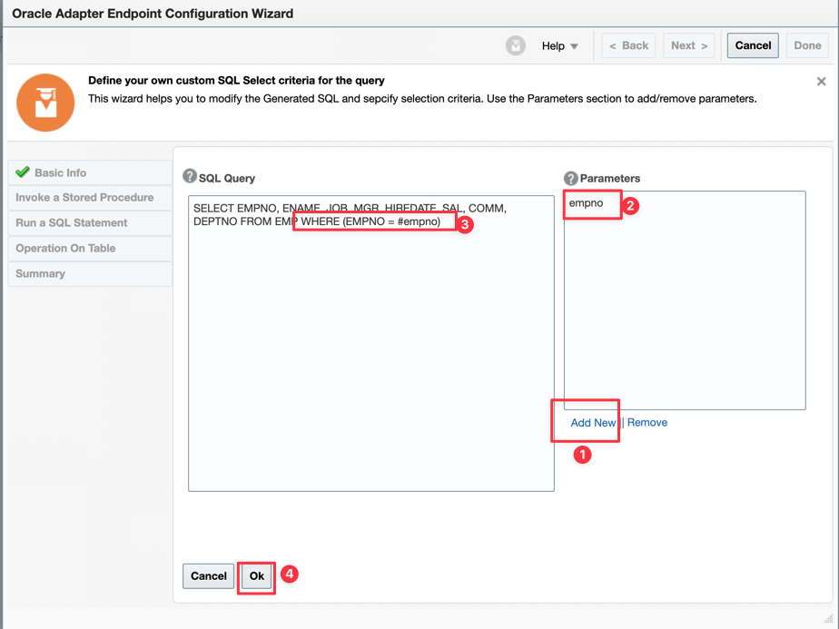
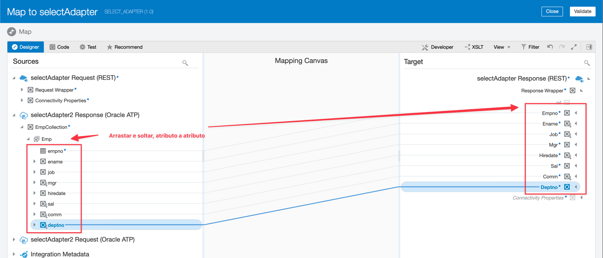
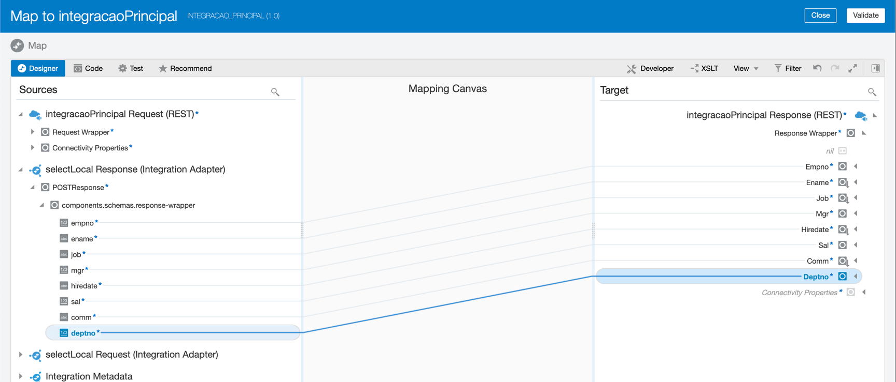
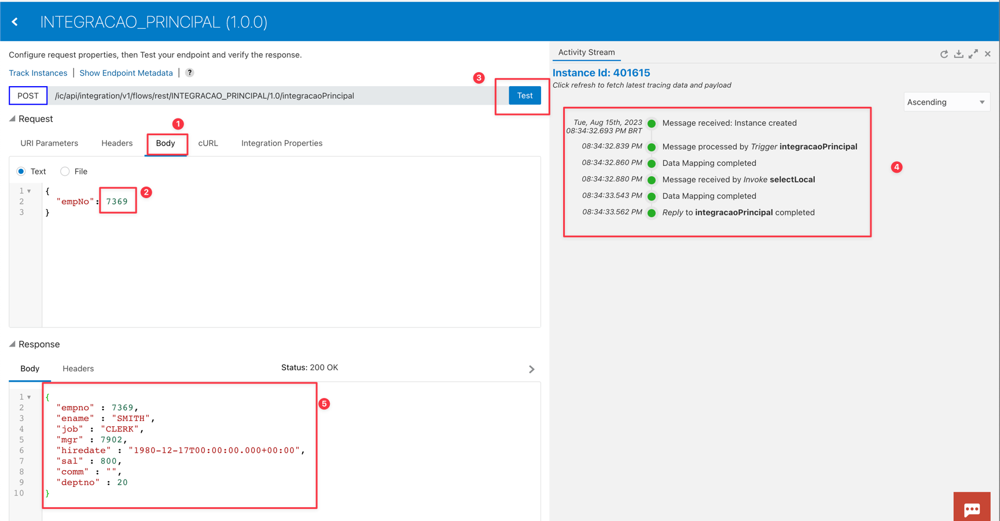

# Integrações com Banco de Dados para Oracle Integration

### Introdução

Em situações em que o OIC precisa trabalhar com banco de dados Oracle, é possível utilizar o Adapter do OIC, porém na versão 11g, o OIC não conta com suporte para trabalhar com o Adapter. Logo, a saída para podermos acessar o banco 11g é trabalhar com ORDS (Oracle REST Data Source). Este componente permite expor as tabelas e procedures do banco Oracle 11g através de serviço REST o que possibilita o OIC de fazer estes acessos.

O objetivo deste documento é mostrar que:

- É possível planejar o acesso ao banco de dados Oracle 11g através do ORDS
- É possível planejar uma migração de banco de dados Oracle para uma versão mais recente (o Adapter do OIC já é compatível com estas versões mais novas)
- É possível abstrair a camada de acesso ao banco, isolando-a de uma integração, o que possibilita trocar um tipo de acesso por outro (ORDS por Adapter)

### Pre-Requisitos

- ORDS devidamente configurado ao banco de dados alvo
- Tabelas e queries devidamente configuradas para consumo através de serviço REST
- OIC devidamente configurado para acessar os serviços REST do ORDS

### Oracle REST Data Source (ORDS)

Oracle REST Data Services (ORDS) faz a ponte entre o HTTPS e o seu Oracle Database. Um aplicativo Java de camada intermediária, o ORDS fornece uma API REST de Gerenciamento de Banco de Dados, o SQL Developer Web, um Gateway PL/SQL, SODA para REST e capacidade de publicar Serviços da Web em RESTful para interagir com os dados e procedimentos armazenados no Oracle Database.

### Vantagens de utilizar ORDS

- Isolamento do Banco de Dados para acessos diretos
- Camada REST API 
- Evita necessidade de importar drivers de banco de dados na aplicação
- Boa performance

### Migrando ORDS para OIC Database Adapter

Para tornar a tarefa de migrar ORDS para o Adapter de Banco de Dados de OIC com o menor esforço possível, devemos manter em mente:

- Implementar a integração principal com chamadas para integrações específicas com acesso a banco. Em outras palavras, implementar integrações pontuais específicas de acesso ao banco de dados e chamá-las na implementação da integração principal. Assim, quando houver necessidade de migração, basta trocar a implementação da integração de banco e ajustar o apontamento na integração principal.
- Na integração com adapter, implementar como trigger para REST
- Criar as integrações com banco ORDS e Adapter com o mesmo nome 
- Criar as integrações com banco com uma mesma interface de entrada e de saída, com as mesmas estruturas JSON
- Criar as integrações com banco com o mesmo path REST

Ao chamar a Integração específica de banco de dados, implementar a chamada com o Local Integration.
Ao trocar o apontamento de ORDS para Adapter, não haverá perda de mapeamentos

### Criar a integração de chamada ao banco de dados por ORDS

Criar uma conexão para o ORDS através de um Adapter REST conforme abaixo. Importante definir a URL endpoint para o serviço ORDS e suas credenciais de acesso.

Como padrão, criar uma integração como trigger REST e estabelecer um caminho de chamada como mostra o exemplo abaixo:

> Importante: Esta parte da configuração acima deve ser idêntica tanto para definir acessos do tipo ORDS como do tipo OIC Adapter.

Agora vamos configurar a chamada ao banco de dados através do serviço ORDS:

Você vai precisar chamar o serviço ORDS correspondente para obter o JSON e incluir na configuração do OIC:

Agora inclua o JSON obtido no OIC e finalize a configuração:

Pronto! Agora vamos finalizar as cofigurações mapeando os parâmetros de entrada e saída do serviço

Clique em Validate e Close para finalizar a configuração de entrada

Agora vamos configurar o retorno

Clique em Validate e Close e finalize a configuração

Finalize a configuração se sua chamada REST em ORDS com a parametrização dos dados de tracking, Salve a integração e ative-a:

> Importante: Defina as estruturas JSON de entrada e saída mais o caminho do serviço REST de forma idêntica para implementações com chamadas ORDS e Adapter OIC

Teste sua integração com chamada via ORDS

> Importante: Exporte sua integração SELECT ADAPTER pois iremos demonstrar como migrar uma integração ou outra (ORDS ou Adapter). Após a exportação, valide se o artefato .iar foi gerado e delete sua integração.

### Criar a integração de chamada ao banco de dados por Adapter

Criar uma conexão para o Banco de Dados Oracle através de seu Adapter correspondente conforme abaixo. Importante definir as credenciais de acesso ao banco de dados (Wallet, usuário/senha ou outro método adequado)

Como padrão, criar uma integração como trigger REST e estabelecer um caminho de chamada como mostra o exemplo abaixo. Este início é exatamente idêntico ao padrão criado para ORDS.

> Importante: Abaixo selecionamos o nome SELECT_ADAPTER exatamente como construído para a chamada ORDS. Isso só poderá ser feito caso você tenha deletado a integração anterior de ORDS. Caso queira manter as 2 integrações, escolha um nome diferente.

> Importante: Esta parte da configuração acima deve ser idêntica tanto para definir acessos do tipo ORDS como do tipo OIC Adapter.

Vamos construir o acesso ao banco de dados através do adapter OIC. 

Defina também a estrutura JSON para os parâmetros de entrada e também os de saída.

Da mesma forma como na integração por ORDS, execute o teste para validar.

### Criar a integração principal com chamada para o banco de dados

A integração principal sempre deve representar a orquestração e os processos principais, deixando que as chamadas de banco de dados sejam feitas por outra integrações em separado.
Isto dará a capacidade de migração sem muito esforço no caso de necessidade de mudar o método de acesso (ORDS para Adapter).

Desta forma, definir a orquestração e realizar as chamadas ao banco de dados através de uma chamada do tipo "Local" conforme abaixo:

Até aqui, é muito parecido com as integrações anteriores, porém é nesta camada de integração que as orquestrações, transformações de negócios ou outros processos devem ser implementados.
Lembre, é aqui que a integração ocorre, quer seja por acesso via ORDS ou via Adapter OIC.

Agora vamos implementar a chamada para o banco de dados através da integração específica via ORDS ou Adapter

E agora vamos configurar os parametros de entrada e a saída JSON

Vamos configurar as informações de tracking e testar a integração

Sucesso! Sua integração principal foi implementada com sucesso.

### Promovendo a troca de ORDS para Adapter

Promover a troca das chamadas ORDS para Adapter é bem simples. Se a estrutura de entrada e saída e também o caminho da chamada REST são idênticas, basta:

- Deletar as integrações pontuais de banco de dados e substituir pelas ORDS (Em nosso tutorial, delete a integração SELECT_ADAPTER)

Ao deletar o artefato de acesso ao banco via ORDS, os mapeamentos continuarão presentes na integração principal. 

- Basta então importar o artefato novo equivalente à chamada ao banco (artefato com chamada ao banco de dados via ORDS. Lembre que o teste anterior está executando via Adapter OIC).

- Ao importar esse novo artefato, o OIC manterá todos os mapeamentos anteriores, preservando a chamada sem necessidade de maiores configurações.

> Conclusão: É possível implementar as integrações com as orquestrações, transformações e mante-las intactas se utilizarmos padrões de camadas para as chamadas ao banco de dados. Esse isolamento garante que no futuro, uma troca de método para chamar o banco tenha o menor nível de esforço.

### Performance

Problema com page size

A partir de uma integração que tem como objetivo executar 100 vezes a chamada ao banco de dados, podemos testar a chamada através do adapter do OIC e também a chamada via ORDS

Lembrando que a tabela possui algo em torno de 14 registors e com 8 campos, a query é um SELECT desta tabela.
Para efeitos comparativos, obtemos os seguintes resultados:

Chamadas ao banco de dados através do Adapter OIC

Chamadas ao banco de dados através de ORDS

> **Importante**: 
> 
> Tempos executados com **Autonomous Database Transaction Processing** com o mínimo de 1 OCPU
> 
> **Autonomous** e **OIC** (na Cloud Oracle) estão integrados através de conexão Internet
> 
> 

Se aumentarmos a tabela para 500 registros, obteremos os seguintes resultados:

Chamadas ao banco de dados através do Adapter OIC (para 500 registros)

Chamadas ao banco de dados através de ORDS (para 500 registros)

### Referências

* [Build Your First REST Integration](https://apexapps.oracle.com/pls/apex/f?p=44785:50:106332613417553:::50:P50_COURSE_ID,P50_EVENT_ID:344,6079)
* [Oracle REST Data Services (ORDS) best practices](https://www.oracle.com/database/technologies/appdev/rest/best-practices/)
* [Improving the performance of Oracle Integration flows that use REST calls](https://www.ateam-oracle.com/post/improving-the-performance-of-oracle-integration-flows-that-use-rest-calls)
* [Armazenando Respostas no Cache para Melhorar o Desempenho](https://docs.oracle.com/pt-br/iaas/Content/APIGateway/Tasks/apigatewayresponsecaching.htm)
* [Using the Oracle Database Adapter with Oracle Integration Generation 2](https://docs.oracle.com/en/cloud/paas/integration-cloud/database-adapter/index.html#Oracle®-Cloud)
* [ORDS Tutorial](https://docs.oracle.com/database/ords-17/QSORD/get-started-with-oracle-rest-data-services.htm#QSORD-GUID-DA141A40-43D8-46D6-8EBB-7FCE43BF79E8)
